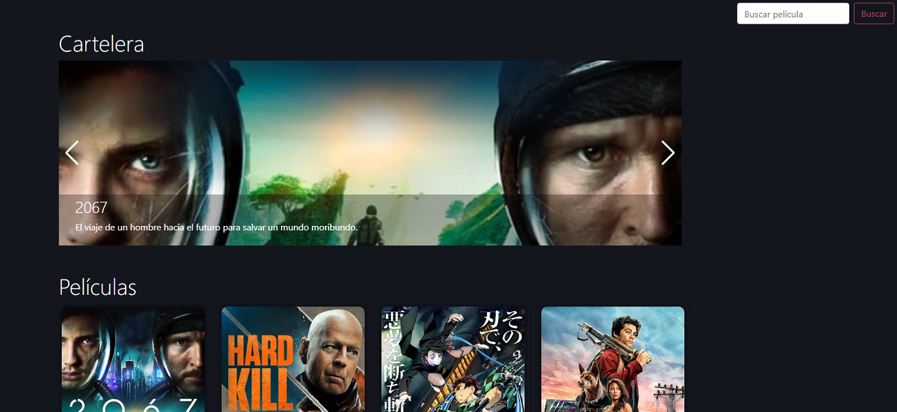

# PeliculasApp

Proyecto realizado en [Angular CLI](https://github.com/angular/angular-cli) version 10.0.8.

## Objetivo
Conexion API, conexion entre componentes y traspaso de información.

### Visita el proyecto.

[Visita el proyecto](https://funny-froyo-6f51a8.netlify.app)

## Lenguajes
+ Angular
+ Typescript
+ CSS
